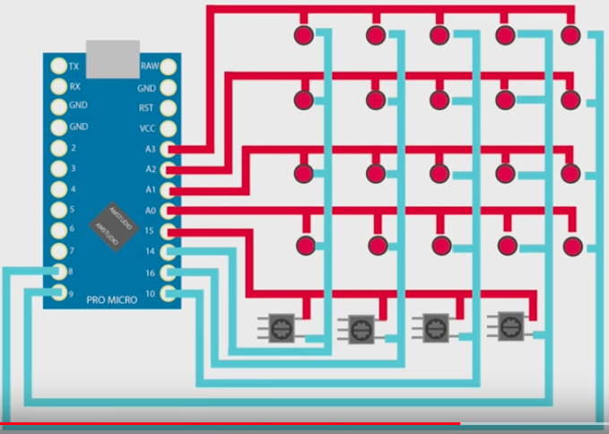
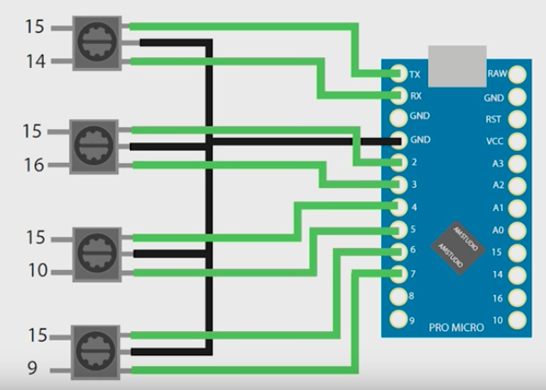

# 32-FUNCTION-BUTTON-BOX

How to make a DIY USB button box with encoders. A 32 Function button box for Sim Racing, also suitable for Truck simulator or Flight Sims. Design and build the layout, size and function for your requirements. Based around a Arduino Pro Micro. 

View YouTube Video here for setup instructions: https://youtu.be/Z7Sc4MJ8RPM

How to assign the buttons to keyboard: https://youtu.be/kbuyXz9sNw0

Please consider supporting: https://www.patreon.com/AMSTUDIO

Feel free to share the video. 

Thanks!

This work is licensed under a Creative Commons Attribution-NonCommercial-NoDerivatives 4.0 International License.
https://creativecommons.org/licenses/by-nc-nd/4.0/

## Setup development environment
Install the Arduino IDE from Arduino.cc
Install the [Joystick library](https://github.com/MHeironimus/ArduinoJoystickLibrary) by copying the Joystick folder into the Arduino IDE Library folder.

## Wiring diagrams
Button Wiring:

Rotary Wiring:

## Parts
- Switch Covers https://goo.gl/rqkD64
- Momentary toggle eBay https://goo.gl/PXEJ1m
- Start button https://goo.gl/i1gjnW
- 3 way toggle eBay https://goo.gl/3hfQUR
- Push button https://goo.gl/9dWnkm eBay https://goo.gl/mjqvgp
- Encoders https://goo.gl/rXZpYu
- Suitable Encoder knobs https://goo.gl/PLGrww
- Usb cable https://goo.gl/3im6cQ
- Enclosure https://goo.gl/jnHMcf
- Carbon Vinyl https://goo.gl/7vUNWv
- Pro Micro https://goo.gl/XZgo4B
- Solder https://goo.gl/vjwbbv
- Soldering iron https://goo.gl/T3CRNq
- Wire https://goo.gl/5R8bPJ
- Wire strippers https://goo.gl/6NMeGT
- Side cutters https://goo.gl/RrxJTJ
- Screw Drivers mini https://goo.gl/o7VSL5
- Sketch https://goo.gl/TqxUQW
